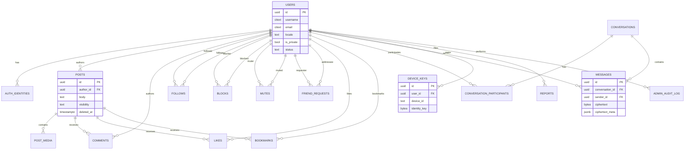

# 21 — ER Diagrams

Mermaid ER diagram for the Phase 1 schema (doc 20). Renders in any Mermaid-compatible viewer (GitHub, most doc tooling).

## Reading Notes
- `FOLLOWS`, `BLOCKS`, `MUTES` are each self-referential many-to-many on `USERS` (two FK roles per table) — diagrammed above with the "follower"/"followee" style role labels since a plain ERD tool would otherwise draw two ambiguous lines back to the same entity.
- `LIKES`/`BOOKMARKS` polymorphic target (doc 20 design note) isn't drawn as a formal FK relationship since Postgres itself doesn't enforce it that way — this is a known, documented exception to strict referential integrity in this schema, kept intentionally small in scope.
- Phase 2+ entities (Stories, Communities, group-chat-specific fields) will extend this diagram in a versioned follow-up once those schemas are added in doc 20, not speculatively diagrammed now.
